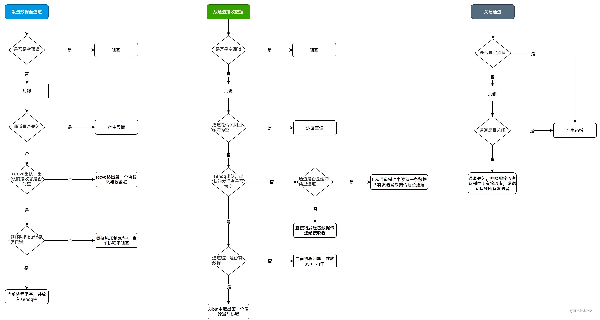

### channel 什么情况下会出现panic
```
1. 试图往已close的channel继续发送
2. 试图关闭已关闭的channel
3. 试图关闭一个nil的channel
```
### 向为nil的channel发送数据会怎样
```
给定一个 nil channel c:
<-c 从 c 接收将永远阻塞
c <- v 发送值到 c 会永远阻塞
```
### channel close后读的问题
```
关闭后继续读数据，已在缓冲区内的可以读取到数据，而后得到的是零值(对于int，就是0)。

我们可以通过for循环遍历channel，来获取到已经写入的值
for _, v := range channel{
    
}

对于可能获取到零值，我们可以使用断言判断，ok为false代表channel已关闭后读取的
value, ok := <- channel

也可以在close channel之后有意将channel 置为 nil， 如此再使用，并不会读取到零值


对于不带缓冲的ch，和带缓冲的一样，channel close掉之后并不影响读，只影响写入
```
### channel的底层结构
```go
type hchan struct {
    qcount   uint           // total data in the queue  代表 chan 中已经接收但还没被取走的元素的个数。内建函数 len 可以返回这个字段的值。
    dataqsiz uint           // size of the circular queue 循环队列的大小
    buf      unsafe.Pointer // points to an array of dataqsiz elements 循环队列的指针
    elemsize uint16         // chan中元素的大小
    closed   uint32         // 是否已closed
    elemtype *_type         // element type chan中元素类型
    sendx    uint           // send index send在buf中的索引
    recvx    uint           // receive index recv在buf中的索引
    recvq    waitq          // list of recv waiters receiver中的等待队列
    sendq    waitq          // list of send waiters sender的等待队列
}
```
go的channel底层结构包含三部分：
1. 与buffer相关的属性字段，qcount， dataqsiz，buf。当 channel 的缓冲区大小不为 0 时，buffer 中存放了待接收的数据。使用 ring buffer 实现
2. waitq 相关的属性，可以理解为是一个 FIFO 的标准队列。其中 recvq 中是正在等待接收数据的 goroutine，sendq 中是等待发送数据的 goroutine。waitq 使用双向链表实现。
3. 其他属性，例如 lock、elemtype、closed 等

```go
// 1. 如果是nil channel 则直接阻塞
// 2. chan已经被close的情景，如果继续发送，则报panic
// 3. 从接收队列中出队一个等待的receiver
//    场景一：性能最好的场景，我投递的元素刚好有人在等着（那我直接给他就完了）;
//    调用的是 send 函数，递增 sendx, recvx 的索引，然后直接把元素给到等他的人，并且唤醒他；
// 4. 缓存区未满，场景二：ring buffer 还有空间，那么把元素放好，递增索引，就可以返回了；
// 5. 如果 buf 满了，发送者的 goroutine 就会加入到发送者的等待队列sendq中，直到被唤醒。
//    这个时候，数据或者被取走了，或者 chan 被 close 了
//    要阻塞当前 goroutine，所以做的事情本质上就是保留好通知路径，等待条件满足，会在这个地方唤醒；
func chansend(c *hchan, ep unsafe.Pointer, block bool, callerpc uintptr) bool {
	// 如果是nil channel 则直接阻塞
	if c == nil {
		if !block {
			return false
		}
		gopark(nil, nil, waitReasonChanSendNilChan, traceEvGoStop, 2)
		throw("unreachable")
	}

	if debugChan {
		print("chansend: chan=", c, "\n")
	}

	if raceenabled {
		racereadpc(c.raceaddr(), callerpc, funcPC(chansend))
	}

	// Fast path: check for failed non-blocking operation without acquiring the lock.
	//
	// After observing that the channel is not closed, we observe that the channel is
	// not ready for sending. Each of these observations is a single word-sized read
	// (first c.closed and second full()).
	// Because a closed channel cannot transition from 'ready for sending' to
	// 'not ready for sending', even if the channel is closed between the two observations,
	// they imply a moment between the two when the channel was both not yet closed
	// and not ready for sending. We behave as if we observed the channel at that moment,
	// and report that the send cannot proceed.
	//
	// It is okay if the reads are reordered here: if we observe that the channel is not
	// ready for sending and then observe that it is not closed, that implies that the
	// channel wasn't closed during the first observation. However, nothing here
	// guarantees forward progress. We rely on the side effects of lock release in
	// chanrecv() and closechan() to update this thread's view of c.closed and full().
	if !block && c.closed == 0 && full(c) {
		return false
	}

	var t0 int64
	if blockprofilerate > 0 {
		t0 = cputicks()
	}

	lock(&c.lock)
	// chan已经被close的情景，如果继续发送，则报panic
	if c.closed != 0 {
		unlock(&c.lock)
		panic(plainError("send on closed channel"))
	}
    // 从接收队列中出队一个等待的receiver
    // 场景一：性能最好的场景，我投递的元素刚好有人在等着（那我直接给他就完了）;
    // 调用的是 send 函数，递增 sendx, recvx 的索引，然后直接把元素给到等他的人，并且唤醒他；
	if sg := c.recvq.dequeue(); sg != nil {
		// Found a waiting receiver. We pass the value we want to send
		// directly to the receiver, bypassing the channel buffer (if any).
		send(c, sg, ep, func() { unlock(&c.lock) }, 3)
		return true
	}
    // 场景二：ring buffer 还有空间，那么把元素放好，递增索引，就可以返回了；
	if c.qcount < c.dataqsiz {
		// Space is available in the channel buffer. Enqueue the element to send.
		qp := chanbuf(c, c.sendx)
		if raceenabled {
			racenotify(c, c.sendx, nil)
		}
		typedmemmove(c.elemtype, qp, ep)
		c.sendx++
		if c.sendx == c.dataqsiz {
			c.sendx = 0
		}
		c.qcount++
		unlock(&c.lock)
		return true
	}

	if !block {
		unlock(&c.lock)
		return false
	}
	// 如果 buf 满了，发送者的 goroutine 就会加入到发送者的
	// 等待队列中，直到被唤醒。这个时候，数据或者被取走了，或者 chan 被 close 了
	// Block on the channel. Some receiver will complete our operation for us.
	// 要阻塞当前 goroutine，所以做的事情本质上就是保留好通知路径，等待条件满足，会在这个地方唤醒；
	// Block on the channel. Some receiver will complete our operation for us.
	gp := getg()
	mysg := acquireSudog()
	mysg.releasetime = 0
	if t0 != 0 {
		mysg.releasetime = -1
	}
	// No stack splits between assigning elem and enqueuing mysg
	// on gp.waiting where copystack can find it.
	mysg.elem = ep
	mysg.waitlink = nil
	mysg.g = gp
	mysg.isSelect = false
	mysg.c = c
	gp.waiting = mysg
	gp.param = nil
	c.sendq.enqueue(mysg)
	// Signal to anyone trying to shrink our stack that we're about
	// to park on a channel. The window between when this G's status
	// changes and when we set gp.activeStackChans is not safe for
	// stack shrinking.
	atomic.Store8(&gp.parkingOnChan, 1)
    // 将当前goroutine放入waiting状态，并释放c.lock锁
	gopark(chanparkcommit, unsafe.Pointer(&c.lock), waitReasonChanSend, traceEvGoBlockSend, 2)
	// Ensure the value being sent is kept alive until the
	// receiver copies it out. The sudog has a pointer to the
	// stack object, but sudogs aren't considered as roots of the
	// stack tracer.
	KeepAlive(ep)

	// someone woke us up.
	if mysg != gp.waiting {
		throw("G waiting list is corrupted")
	}
	gp.waiting = nil
	gp.activeStackChans = false
	closed := !mysg.success
	gp.param = nil
	if mysg.releasetime > 0 {
		blockevent(mysg.releasetime-t0, 2)
	}
	mysg.c = nil
	releaseSudog(mysg)
	if closed {
		if c.closed == 0 {
			throw("chansend: spurious wakeup")
		}
		panic(plainError("send on closed channel"))
	}
	return true
}
```

```go
// 1. nil channel 永久阻塞
// 2. 当通道已关闭，且通道缓冲没有元素时候，直接返回
// 3. 从发送队列中取出一个发送者，发送者不为空时候，将发送者数据传递给接收者
// 4. 缓冲队列中有数据情况下，从缓存队列取出数据，传递给接收者
func chanrecv(c *hchan, ep unsafe.Pointer, block bool) (selected, received bool) {
	// 如果是nil channel，则阻塞
	if c == nil {
		if !block {
			return
		}
		gopark(nil, nil, waitReasonChanReceiveNilChan, traceEvGoStop, 2)
		throw("unreachable")
	}

	// Fast path: check for failed non-blocking operation without acquiring the lock.
	if !block && empty(c) {
		
		if atomic.Load(&c.closed) == 0 {
			return
		}
		if empty(c) {
			// The channel is irreversibly closed and empty.
			if raceenabled {
				raceacquire(c.raceaddr())
			}
			if ep != nil {
				typedmemclr(c.elemtype, ep)
			}
			return true, false
		}
	}

	var t0 int64
	if blockprofilerate > 0 {
		t0 = cputicks()
	}

	lock(&c.lock)
    // 当通道已关闭，且通道缓冲没有元素时候，直接返回
	if c.closed != 0 && c.qcount == 0 {
		if raceenabled {
			raceacquire(c.raceaddr())
		}
		unlock(&c.lock)
		if ep != nil {
			typedmemclr(c.elemtype, ep)
		}
		return true, false
	}
    // 从发送者队列中取出一个发送者，发送者不为空时候，将发送者数据传递给接收者
	if sg := c.sendq.dequeue(); sg != nil {
		// Found a waiting sender. If buffer is size 0, receive value
		// directly from sender. Otherwise, receive from head of queue
		// and add sender's value to the tail of the queue (both map to
		// the same buffer slot because the queue is full).
		recv(c, sg, ep, func() { unlock(&c.lock) }, 3)
		return true, true
	}

	if c.qcount > 0 {
		// Receive directly from queue
		qp := chanbuf(c, c.recvx)
		if raceenabled {
			racenotify(c, c.recvx, nil)
		}
		if ep != nil {
			typedmemmove(c.elemtype, ep, qp)
		}
		typedmemclr(c.elemtype, qp)
		c.recvx++
		if c.recvx == c.dataqsiz {
			c.recvx = 0
		}
		c.qcount--
		unlock(&c.lock)
		return true, true
	}

	if !block {
		unlock(&c.lock)
		return false, false
	}

	// no sender available: block on this channel.
	gp := getg()
	mysg := acquireSudog()
	mysg.releasetime = 0
	if t0 != 0 {
		mysg.releasetime = -1
	}
	// No stack splits between assigning elem and enqueuing mysg
	// on gp.waiting where copystack can find it.
	mysg.elem = ep
	mysg.waitlink = nil
	gp.waiting = mysg
	mysg.g = gp
	mysg.isSelect = false
	mysg.c = c
	gp.param = nil
	c.recvq.enqueue(mysg)
	// Signal to anyone trying to shrink our stack that we're about
	// to park on a channel. The window between when this G's status
	// changes and when we set gp.activeStackChans is not safe for
	// stack shrinking.
	atomic.Store8(&gp.parkingOnChan, 1)
	gopark(chanparkcommit, unsafe.Pointer(&c.lock), waitReasonChanReceive, traceEvGoBlockRecv, 2)

	// someone woke us up
	if mysg != gp.waiting {
		throw("G waiting list is corrupted")
	}
	gp.waiting = nil
	gp.activeStackChans = false
	if mysg.releasetime > 0 {
		blockevent(mysg.releasetime-t0, 2)
	}
	success := mysg.success
	gp.param = nil
	mysg.c = nil
	releaseSudog(mysg)
	return true, success
}
```

```go
// 1. nil的channel关闭直接panic
// 2. closed的channel关闭直接panic
// 3. 遍历所有的接受队列与发送队列，并依次唤醒对应的goroutine
func closechan(c *hchan) {
	// 当关闭的通道是nil时候，直接恐慌
	if c == nil {
		panic(plainError("close of nil channel"))
	}
	// 加锁
	lock(&c.lock)
    // 通道已关闭，再次关闭直接恐慌
	if c.closed != 0 {
		unlock(&c.lock)
		panic(plainError("close of closed channel"))
	}
    ...
	c.closed = 1 // 关闭标志closed置为1
	var glist gList
    // 将接收者添加到glist中
	for {
		sg := c.recvq.dequeue()
		if sg == nil {
			break
		}
		if sg.elem != nil {
			typedmemclr(c.elemtype, sg.elem)
			sg.elem = nil
		}
		if sg.releasetime != 0 {
			sg.releasetime = cputicks()
		}
		gp := sg.g
		gp.param = nil
		if raceenabled {
			raceacquireg(gp, c.raceaddr())
		}
		glist.push(gp)
	}
	// 将发送者添加到glist中
	for {
		sg := c.sendq.dequeue()
		if sg == nil {
			break
		}
		sg.elem = nil
		if sg.releasetime != 0 {
			sg.releasetime = cputicks()
		}
		gp := sg.g
		gp.param = nil
		if raceenabled {
			raceacquireg(gp, c.raceaddr())
		}
		glist.push(gp) // 
	}
	unlock(&c.lock)

	// 循环glist，调用goready唤醒所有接收者和发送者
	for !glist.empty() {
		gp := glist.pop()
		gp.schedlink = 0
		goready(gp, 3)
	}
}

```

https://juejin.cn/post/6898132039812431885
