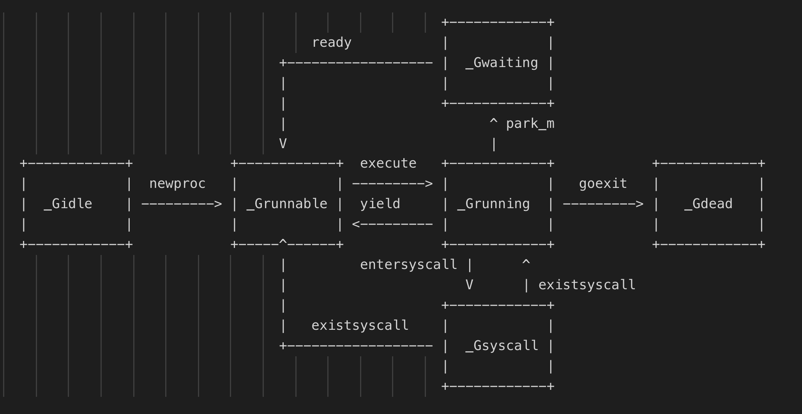

### 相关文章
https://tonybai.com/2017/06/23/an-intro-about-goroutine-scheduler/
https://tonybai.com/2020/03/21/illustrated-tales-of-go-runtime-scheduler/
https://draveness.me/golang/docs/part3-runtime/ch06-concurrency/golang-goroutine/
https://www.kancloud.cn/aceld/golang/1958305#GoroutineGMP_164
https://segmentfault.com/a/1190000023869478
https://www.luozhiyun.com/archives/448
https://zboya.github.io/post/go_scheduler/
https://www.bilibili.com/video/BV19r4y1w7Nx?p=2&spm_id_from=pageDriver

### 进程，线程，协程的区别
进程：
进程是程序的一次执行过程，是程序在执行过程中的分配和管理资源的基本单位，每个进程都有自己的地址空间,进程是系统进行资源分配和调度的一个独立单位。
每个进程都有自己的独立内存空间，由于进程比较重量，占据独立的内存，所以上下文进程间的切换开销（栈、寄存器、虚拟内存、文件句柄等）比较大，但相对比较稳定安全。

线程：在同一个进程中的不同线程共享相同的地址空间(虚拟内存，代表切换不需要切换页表)，每个线程有独立的栈区，程序计数器（执行指令的信息），栈指针以及函数运行的寄存器。
初始栈大小8M，ulimit - s可以查看。调度由系统调度。从用户态切换到内核态，上下文切换消耗相对大
协程：用户态线程，不由内核管理，由go的底层调度器控制，协程初始栈大小2K。由用户调度

### goroutine初始栈大小，上下文如何切换，存在哪里
协程初始栈大小2K，上下文由g0去调度找到对应可以运行的goroutine，存在gorountine的gobuf中
### GMP调度流程
1. 概念
```text
G：goroutine(协程)
调度系统的最基本单位goroutine，存储了goroutine的执行stack信息、goroutine状态以及goroutine的任务函数等。
在G的眼中只有P，P就是运行G的“CPU”。
相当于两级线程

M：
M代表着真正的执行计算资源，可以认为它就是os thread（系统线程）。
M是真正调度系统的执行者，每个M就像一个勤劳的工作者，总是从各种队列中找到可运行的G，而且这样M的可以同时存在多个。
M在绑定有效的P后，进入调度循环，而且M并不保留G状态，这是G可以跨M调度的基础。

P：processor
P表示逻辑processor，代表线程M的执行的上下文。
P的最大作用是其拥有的各种G对象队列、链表、cache和状态。
P的数量也代表了golang的执行并发度，即有多少goroutine可以同时运行
```
2. 执行流程
```text
入口文件asm_amd64.s:程序的初始化和启动调度系统(汇编)
// 程序刚启动的时候必定有一个线程启动（主线程）
// 将当前的栈和资源保存在g0
// 将该线程保存在m0

//m0和g0互相绑定(m结构体中的g0与g结构体的m赋值)
// 处理args
// os初始化， os_linux.go
// 调度系统初始化, proc.go

// 创建一个goroutine，然后开启执行程序


1. 调用 runtime·osinit 来获取系统的cpu个数。
2. 调用 runtime·schedinit 来初始化调度系统，会进行p的初始化，也会把m0和某个p绑定。 
3. 调用 runtime·newproc 新建一个goroutine，也叫main goroutine，它的任务函数是 runtime.main 函数，建好后插入m0绑定的p的本地队列。
4. 调用 runtime·mstart 来启动m，进入启动调度系统。

mstart1:
// 确保g是系统栈上的g0
// 调度器只在g0上执行

schedule: 直正调度
1. 每隔61次调度轮回从全局队列找，避免全局队列中的g被饿死。
2. 从p.runnext获取g，从p的本地队列中获取。
3. 调用 findrunnable 找g，找不到的话就将m休眠，等待唤醒。
 findrunnable 查找G的过程：
1. 调用 runqget ，尝试从P本地队列中获取G，获取到返回
2. 调用 globrunqget ，尝试从全局队列中获取G，获取到返回
3. 从网络IO轮询器中找到就绪的G，把这个G变为可运行的G
4. 如果不是所有的P都是空闲的，最多四次，随机选一个P，尝试从这P中偷取一些G，获取到返回
5. 上面都找不到G来运行，判断此时P是否处于 GC mark 阶段，如果是，那么此时可以安全的扫描和黑化对象和返回 gcBgMarkWorker 来运行， gcBgMarkWorker 是GC后代标记的goroutine。
6. 再次从全局队列中获取G，获取到返回
7. 再次检查所有的P，有没有可以运行的G
8. 再次检查网络IO轮询器
9. 实在找不到可运行的G了，那就调用 stopm 休眠吧
```
3.m0与g0
```text
m0 表示进程启动的第一个线程，也叫主线程。
它和其他的m没有什么区别，要说区别的话，它是进程启动通过汇编直接复制给m0的，m0是个全局变量，而其他的m都是runtime内自己创建的。 m0 的赋值过程，可以看前面 runtime/asm_amd64.s 的代码。一个go进程只有一个m0。

首先要明确的是每个m都有一个g0，因为每个线程有一个系统堆栈，g0 虽然也是g的结构，但和普通的g还是有差别的，最重要的差别就是栈的差别。
g0 上的栈是系统分配的栈，在linux上栈大小默认固定8MB，不能扩展，也不能缩小。 而普通g一开始只有2KB大小，可扩展。在 g0 上也没有任何任务函数，也没有任何状态，并且它不能被调度程序抢占。因为调度就是在g0上跑的。

 m0代表主线程、g0代表了线程的堆栈。调度都是在系统堆栈上跑的，也就是一定要跑在 g0 上，所以 mstart1 函数才检查是不是在g0上， 因为接下来就要执行调度程序了。
 
```
4.调度架构
```text
                            +-------------------- sysmon ---------------//------+ 
                            |                                                   |
                            |                                                   |
               +---+      +---+-------+                   +--------+          +---+---+
go func() ---> | G | ---> | P | local | <=== balance ===> | global | <--//--- | P | M |
               +---+      +---+-------+                   +--------+          +---+---+
                            |                                 |                 | 
                            |      +---+                      |                 |
                            +----> | M | <--- findrunnable ---+--- steal <--//--+
                                   +---+ 
                                     |
                                   mstart
                                     |
              +--- execute <----- schedule 
              |                      |   
              |                      |
              +--> G.fn --> goexit --+ 


              1. go func() 语气创建G。
              2. 将G放入P的本地队列（或者平衡到全局队列）。
              3. 唤醒或新建M来执行任务。
              4. 进入调度循环
              5. 尽力获取可执行的G，并执行
              6. 清理现场并且重新进入调度循环
```
5. g的创建
   
   调用newproc创建
```text
1. 用 systemstack 切换到系统堆栈，调用 newproc1 ，newproc1 实现g的获取。
2. 尝试从p的本地g空闲链表和全局g空闲链表找到一个g的实例。
3. 如果上面未找到，则调用 malg 生成新的g的实例，且分配好g的栈和设置好栈的边界，接着添加到 allgs 数组里面，allgs保存了所有的g。
4. 保存g切换的上下文，这里很关键，g的切换依赖 sched 字段。
5. 生成唯一的goid，赋值给该g。
6. 调用 runqput 将g插入队列中，如果本地队列还有剩余的位置，将G插入本地队列的尾部，若本地队列已满，插入全局队列。
7. 如果有空闲的p 且 m没有处于自旋状态 且 main goroutine已经启动，那么唤醒或新建某个m来执行任务。

```
6. g的状态流转图

   
7.M的创建
```text
新建M是通过 newm 来创建的，最终是通过 newosproc 函数来实现的新建线程，不通平台的 newosproc 有不同的具体实现， 比如linux平台下，是调用 clone 系统调用来实现创建线程。新建线程的任务函数为 mstart ，
所以当线程启动的时候，是执行 mstart 函数的代码。
```
8.P的创建
```text
p的初始化是在 schedinit 函数中调用的，最终调用 procresize 来实现，p的分配。 
p的个数默认等于系统的cpu数，如果设置了 GOMAXPROCS 环境变量，会采用环境变量设置的个数。 
很多人认为runtime.GOMAXPROCS可以限制系统线程的数量，但这是错误的，M是按需创建的，和runtime.GOMAXPROCS没有直接关系
```
### 什么时候触发抢占式调度
```text
sysmon -> retake 抢占式调度
这个抢占式调度的原理则是在每个函数或方法的入口，加上一段额外的代码，让runtime有机会检查是否需要执行抢占调度。这种解决方案只能说局部解决了“饿死”问题，对于没有函数调用，纯算法循环计算的G，scheduler依然无法抢占。

抢占的情况分为两种：
1. P处于系统调用中 当P处于系统调用状态超过10ms，那么调用 handoffp 来检查该P下是否有其他可运行的G。如果有的话， 调用 startm 来常获取一个M或新建一个M来服务。这就是为啥cgo里阻塞很久或者系统调用阻塞很久， 会导致runtime创建很多线程的原因。这里还有一个要注意的地方就是在设置p.status之前，P已经丢弃了M， 这个细节后再讲吧，这里就不介绍了。

P处于正在运行中 检查G运行时间超过forcePreemptNS(10ms)，则抢占这个P，当然这个抢占不是主动的，而是被动的，通过 preemptone 设置P的 stackguard0 设为 stackPreempt 和 gp.preempt = true ，导致该P中正在执行的G进行下一次函数调用时， 导致栈空间检查失败。进而触发 morestack（汇编代码，位于asm_XXX.s中），然后进行一连串的函数调用，最终会调用 goschedImpl 函数，进行解除P与当前M的关联，让该G进入 _Grunnable 状态，插入全局G列表，等待下次调度。触发的一系列函数如下：
morestack() -> newstack() -> gopreempt_m() -> goschedImpl() -> schedule()
自此抢占原理已明了，第一种情况是为了防止系统调用的G，导致P里面的其他G无法调度，也就是饿死的状态。 第二种情况是为何防止一个G运行太长时间，而导致P里面的其他G饿死的状态。

如果一个G任务运行10ms，sysmon就会认为其运行时间太久而发出抢占式调度的请求。一旦G的抢占标志位被设为true，那么待这个G下一次调用函数或方法时，runtime便可以将G抢占，并移出运行状态，放入P的local runq中，等待下一次被调度。
```
channel阻塞或network I/O情况下的调度
```text
如果G被阻塞在某个channel操作或network I/O操作上时，G会被放置到某个wait队列中，而M会尝试运行下一个runnable的G；如果此时没有runnable的G供m运行，那么m将解绑P，并进入sleep状态。当I/O available或channel操作完成，在wait队列中的G会被唤醒，标记为runnable，放入到某P的队列中，绑定一个M继续执行。
```
system call阻塞情况下的调度
```text
如果G被阻塞在某个system call操作上，那么不光G会阻塞，执行该G的M也会解绑P(实质是被sysmon抢走了)，与G一起进入sleep状态。如果此时有idle的M，则P与其绑定继续执行其他G；如果没有idle M，但仍然有其他G要去执行，那么就会创建一个新M。

当阻塞在syscall上的G完成syscall调用后，G会去尝试获取一个可用的P，如果没有可用的P，那么G会被标记为runnable，之前的那个sleep的M将再次进入sleep。
```
```text
程序启动时，在 runtime.sighandler 中注册 SIGURG 信号的处理函数 runtime.doSigPreempt；

在触发垃圾回收的栈扫描时会调用 runtime.suspendG 挂起 Goroutine，该函数会执行下面的逻辑：

将 _Grunning 状态的 Goroutine 标记成可以被抢占，即将 preemptStop 设置成 true；
调用 runtime.preemptM 触发抢占；
runtime.preemptM 会调用 runtime.signalM 向线程发送信号 SIGURG；
操作系统会中断正在运行的线程并执行预先注册的信号处理函数 runtime.doSigPreempt；
runtime.doSigPreempt 函数会处理抢占信号，获取当前的 SP 和 PC 寄存器并调用 runtime.sigctxt.pushCall；
runtime.sigctxt.pushCall 会修改寄存器并在程序回到用户态时执行 runtime.asyncPreempt；
汇编指令 runtime.asyncPreempt 会调用运行时函数 runtime.asyncPreempt2；
runtime.asyncPreempt2 会调用 runtime.preemptPark；
runtime.preemptPark 会修改当前 Goroutine 的状态到 _Gpreempted 并调用 runtime.schedule 让当前函数陷入休眠并让出线程，调度器会选择其它的 Goroutine 继续执行；
```