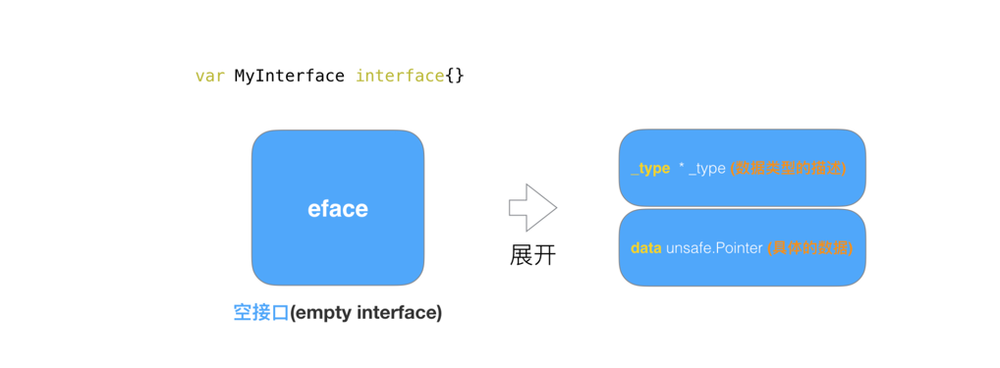
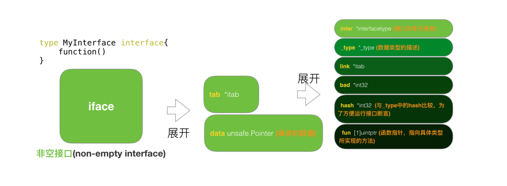

https://www.kancloud.cn/aceld/golang/1958316
https://studygolang.com/articles/21876
https://mp.weixin.qq.com/s/px9BRQrTCLX6BbvXJbysCA

### golang 实现多态的方法
```text
继承与多态的特点

在golang中对多态的特点体现从语法上并不是很明显。

我们知道发生多态的几个要素：

1、有interface接口，并且有接口定义的方法。

2、有子类去重写interface的接口。

3、有父类指针指向子类的具体对象
```
### 空接口与非空接口与nil的判断
#### 空接口eface结构
```go
type eface struct {      //空接口
    _type *_type         //类型信息
    data  unsafe.Pointer //指向数据的指针(go语言中特殊的指针类型unsafe.Pointer类似于c语言中的void*)
}
```
_type属性：是GO语言中所有类型的公共描述，Go语言几乎所有的数据结构都可以抽象成 _type，是所有类型的公共描述，**type负责决定data应该如何解释和操作，**type的结构代码如下:

```go
type _type struct {
    size       uintptr  //类型大小
    ptrdata    uintptr  //前缀持有所有指针的内存大小
    hash       uint32   //数据hash值
    tflag      tflag
    align      uint8    //对齐
    fieldalign uint8    //嵌入结构体时的对齐
    kind       uint8    //kind 有些枚举值kind等于0是无效的
    alg        *typeAlg //函数指针数组，类型实现的所有方法
    gcdata    *byte
    str       nameOff
    ptrToThis typeOff
}
```
data属性: 表示指向具体的实例数据的指针，他是一个unsafe.Pointer类型，相当于一个C的万能指针void*。

#### 非空接口iface
iface 表示 non-empty interface 的数据结构，非空接口初始化的过程就是初始化一个iface类型的结构，其中data的作用同eface的相同，这里不再多加描述。
```go
type iface struct {
  tab  *itab
  data unsafe.Pointer
}
```
iface结构中最重要的是itab结构（结构如下），每一个 itab 都占 32 字节的空间。itab可以理解为pair<interface type, concrete type> 。itab里面包含了interface的一些关键信息，比如method的具体实现。
```go
type itab struct {
  inter  *interfacetype   // 接口自身的元信息
  _type  *_type           // 具体类型的元信息
  link   *itab
  bad    int32
  hash   int32            // _type里也有一个同样的hash，此处多放一个是为了方便运行接口断言
  fun    [1]uintptr       // 函数指针，指向具体类型所实现的方法
}
```
其中值得注意的字段，个人理解如下：

1. interface type包含了一些关于interface本身的信息，比如package path，包含的method。这里的interfacetype是定义interface的一种抽象表示。
2. type表示具体化的类型，与eface的 type类型相同。
3. hash字段其实是对_type.hash的拷贝，它会在interface的实例化时，用于快速判断目标类型和接口中的类型是否一致。另，Go的interface的Duck-typing机制也是依赖这个字段来实现。
4. fun字段其实是一个动态大小的数组，虽然声明时是固定大小为1，但在使用时会直接通过fun指针获取其中的数据，并且不会检查数组的边界，所以该数组中保存的元素数量是不确定的。

