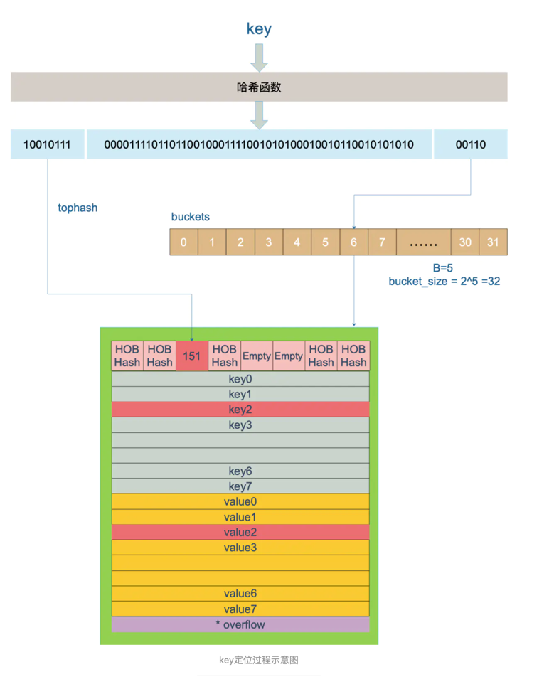

### 相关文章
https://studygolang.com/articles/32943
https://draveness.me/golang/docs/part2-foundation/ch03-datastructure/golang-hashmap/
https://www.jianshu.com/p/fbcaa36cff1c
https://mp.weixin.qq.com/s/8aufz1IzElaYR43ccuwMyA
### map的底层实现原理
> 一般map的实现，有一个数组，用于指向真正的值的指针，使用拉链法来解决key值冲突
> 整个流程大致如下：
```text
                  key
                   |
                   v                 
+------------------------------------+
|      key通过hash函数得到key的hash    |
+------------------+-----------------+
                   |
                   v
+------------------------------------+
|       key的hash通过取模或者位操作     |
|          得到key在数组上的索引        |
+------------------------------------+
                   |
                   v
+------------------------------------+
|         通过索引找到对应的链表         |
+------------------+-----------------+
                   |
                   v
+------------------------------------+
|       遍历链表对比key和目标key        |
+------------------+-----------------+
                   |
                   v
+------------------------------------+
|              相等则返回value         |
+------------------+-----------------+
                   |
                   v                
                 value 
```
go中的map
> Go语言解决hash冲突不是链表，实际主要用的数组(内存上的连续空间)，go不是使用一个数组(连续内存空间)存放键和值，而是使用了两个数组分别存储键和值
> go的结构如下图


hmap结构：
```go
type hmap struct {
    // Note: the format of the hmap is also encoded in cmd/compile/internal/reflectdata/reflect.go.
    // Make sure this stays in sync with the compiler's definition.
    count     int // # live cells == size of map.  Must be first (used by len() builtin) 键值对的数量
    flags     uint8 //状态标识，比如正在被写、buckets和oldbuckets在被遍历、等量扩容(Map扩容相关字段)
    B         uint8  // log_2 of # of buckets (can hold up to loadFactor * 2^B items) 2^B=len(buckets)
    noverflow uint16 // approximate number of overflow buckets; see incrnoverflow for details 溢出桶里bmap大致的数量
    hash0     uint32 // hash seed hash因子

    buckets    unsafe.Pointer // array of 2^B Buckets. may be nil if count==0. 指向一个数组(连续内存空间)，数组的类型为[]bmap，bmap类型就是存在键值对的结构下面会详细介绍，这个字段我们可以称之为正常桶。
    oldbuckets unsafe.Pointer // previous bucket array of half the size, non-nil only when growing 扩容时，存放之前的buckets(Map扩容相关字段)
    nevacuate  uintptr        // progress counter for evacuation (buckets less than this have been evacuated) 分流次数，成倍扩容分流操作计数的字段(Map扩容相关字段)

    extra *mapextra // optional fields 溢出桶结构，正常桶里面某个bmap存满了，会使用这里面的内存空间存放键值对
}
```
runtime bmap结构：
```go
type bmap struct {
	tophash [bucketCnt]uint8 // 哈希key值哈希的高8位
}
```
实际上，在编译期间，因为golang不支持泛型，会为bmap添加一些额外的字段
```go
字段	解释
type bmap struct {
    topbits  [8]uint8 //	长度为8的数组，[]uint8，元素为：key获取的hash的高8位，遍历时对比使用，提高性能
    keys     [8]keytype // 长度为8的数组，[]keytype，元素为：具体的key值。
    values   [8]valuetype // 长度为8的数组，[]elemtype，元素为：键值对的key对应的值
    overflow uintptr // 指向的hmap.extra.overflow溢出桶里的bmap，上面的字段topbits、keys、elems长度为8，最多存8组键值对，存满了就往指向的这个bmap里存
    pad uintptr //对齐内存使用的，不是每个bmap都有会这个字段，需要满足一定条件
}
```
整个map的结构：

溢出桶：当超过8个的时候，会采用溢出桶
```go
// https://github.com/golang/go/blob/go1.13.8/src/runtime/map.go
type mapextra struct {
    overflow    *[]*bmap //称之为溢出桶。和hmap.buckets的类型一样也是数组[]bmap，当正常桶bmap存满了的时候就使用hmap.extra.overflow的bmap。所以这里有个问题正常桶hmap.buckets里的bmap是怎么关联上溢出桶hmap.extra.overflow的bmap呢？我们下面说。
    oldoverflow *[]*bmap //扩容时存放之前的overflow(Map扩容相关字段)
    nextOverflow *bmap //指向溢出桶里下一个可以使用的bmap
}
```
小结
```text
哈希在每一个桶中存储键对应哈希的前 8 位，当对哈希进行操作时，这些 tophash 就成为可以帮助哈希快速遍历桶中元素的缓存。

哈希表的每个桶都只能存储 8 个键值对，一旦当前哈希的某个桶超出 8 个，新的键值对就会存储到哈希的溢出桶中。随着键值对数量的增加，溢出桶的数量和哈希的装载因子也会逐渐升高，超过一定范围就会触发扩容，扩容会将桶的数量翻倍，元素再分配的过程也是在调用写操作时增量进行的，不会造成性能的瞬时巨大抖动。


```
查找key过程
> 先根据算法算出哈希值，哈希后B位作为桶的定位，哈希前8位作为冲突后的对比的位数


### 并发安全的map
实现方式1：使用读写锁
```go
type ConcurrentMap struct{
	map[int]interface
	
	rw sync.RWMutex
}
```
实现方式2：使用分片读写锁
```go
var SHARD_COUNT = 32
type ConcurrentMap []*ConcurrentMapShared

type ConcurrentMapShared struct {
    items map[string]interface{} 
    sync.RWMutex // Read Write mutex, guards access to internal map. 
}
// 创建并发map 
func New() ConcurrentMap { 
	m := make(ConcurrentMap, SHARD_COUNT) 
	for i := 0; i < SHARD_COUNT; i++ { 
		m[i] = &ConcurrentMapShared{items: make(map[string]interface{})}
	}
	return m 
}
```

实现方式3：使用sync.Map,使用的不多，不太像个map，使用时需要查看文档及对特殊的业务场景进行压测
场景一：只会增长的缓存系统中，一个 key 只写入一次而被读很多次
场景二：多个 goroutine 为不相交的键集读、写和重写键值对
```go

```
