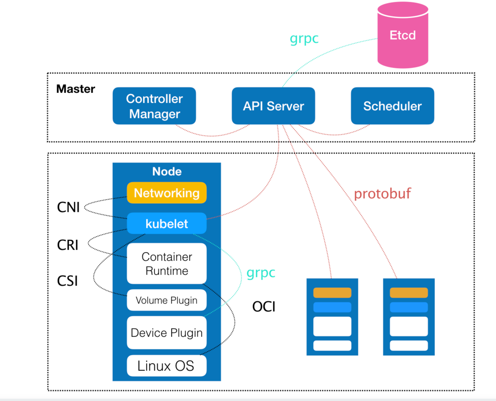
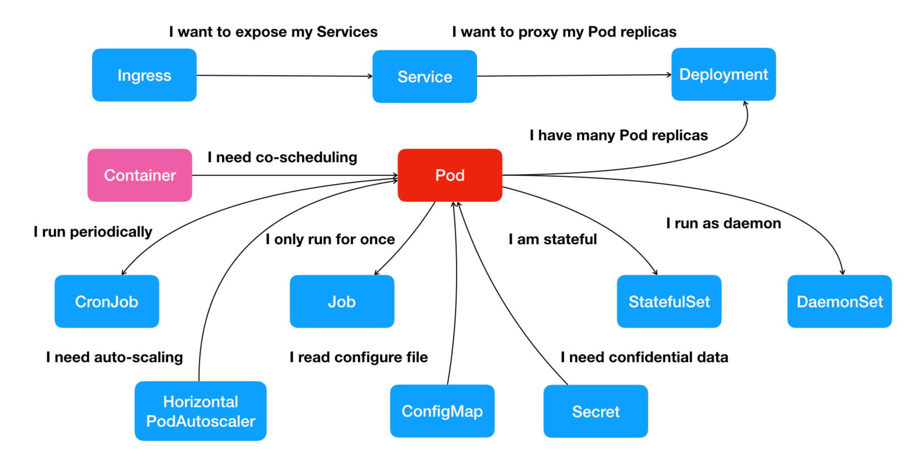

### k8s原理架构图

### pod是主体，引申出其他的概念

### k8s 命令相关
k8s不推荐使用命令直接运行容器等操作，而是希望使用yaml配置文件来创建相关的容器等组件
```text
kubectl create -f 我的配置文件
kubectl get pods -l app=nginx // 获取相关标签的pods
kubectl describe [pod|其他资源] nginx-deployment-67594d6bf6-9gdvr // 查看 Pod 的详细信息
kubectl apply -f nginx-deployment.yaml 创建/更新 配置文件
kubectl exec -it nginx-deployment-5c678cfb6d-lg9lw -- /bin/bash 进入到具体的容器中
kubectl delete -f nginx-deployment.yaml 删除部署
kubectl get -o yaml 会将指定的 Pod API 对象以 YAML 的方式展示出来。
kubectl scale deployment nginx-deployment --replicas=4 副本数量修改
kubectl rollout status deployment/nginx-deployment 查看 Deployment 对象的状态变化
kubectl edit deployment/nginx-deployment 编辑 Etcd 里的 API 对象
kubectl set image deployment/nginx-deployment nginx=nginx:1.91 直接修改 nginx-deployment 所使用的镜像
kubectl rollout undo deployment/nginx-deployment 把整个 Deployment 回滚到上一个版本
kubectl rollout history deployment/nginx-deployment 查看每次 Deployment 变更对应的版本
kubectl rollout history deployment/nginx-deployment --revision=2 回滚到的指定版本的版本号
kubectl rollout pause deployment/nginx-deployment 先暂停
kubectl rollout resume deploy/nginx-deployment 暂停后修改完再更新
```
### 为什么需要pod
```text
容器间的紧密协作，我们可以称为“超亲密关系”。
这些具有“超亲密关系”容器的典型特征包括但不限于：互相之间会发生直接的文件交换、使用 localhost 或者 Socket 文件进行本地通信、会发生非常频繁的远程调用、需要共享某些 Linux Namespace（比如，一个容器要加入另一个容器的 Network Namespace）等等

Pod 最重要的一个事实是：它只是一个逻辑概念。
也就是说，Kubernetes 真正处理的，还是宿主机操作系统上 Linux 容器的 Namespace 和 Cgroups，而并不存在一个所谓的 Pod 的边界或者隔离环境。
Pod，其实是一组共享了某些资源的容器,具体的说，Pod 里的所有容器，共享的是同一个 Network Namespace，并且可以声明共享同一个 Volume。

在 Kubernetes 项目里，Pod 的实现需要使用一个中间容器，这个容器叫作 Infra 容器。在这个 Pod 中，Infra 容器永远都是第一个被创建的容器，而其他用户定义的容器，则通过 Join Network Namespace 的方式，与 Infra 容器关联在一起。

Pod 里的容器 A 和容器 B 来说：

它们可以直接使用 localhost 进行通信；
它们看到的网络设备跟 Infra 容器看到的完全一样；
一个 Pod 只有一个 IP 地址，也就是这个 Pod 的 Network Namespace 对应的 IP 地址；
当然，其他的所有网络资源，都是一个 Pod 一份，并且被该 Pod 中的所有容器共享；
Pod 的生命周期只跟 Infra 容器一致，而与容器 A 和 B 无关。

pod可以理解成有相关关联的一组进程组，每个进程组都可包含1个或多个容器（容器一般只管理一个进程）
```
### sidecar
```text
sidecar 指的就是我们可以在一个 Pod 中，启动一个辅助容器，来完成一些独立于主进程（主容器）之外的工作。
```

### 配置pod与容器，哪些是pod的属性，哪些是容器相关的属性
```text
凡是调度、网络、存储，以及安全相关的属性，基本上是 Pod 级别的,这些属性的共同特征是，它们描述的是“机器”这个整体，而不是里面运行的“程序”。
```

### deployment控制器的流程
```text
Deployment 控制器从 Etcd 中获取到所有携带了“app: nginx”标签的 Pod，然后统计它们的数量，这就是实际状态；

Deployment 对象的 Replicas 字段的值就是期望状态；

Deployment 控制器将两个状态做比较，然后根据比较结果，确定是创建 Pod，还是删除已有的 Pod（具体如何操作 Pod 对象，我会在下一篇文章详细介绍）。


Deployment 实际上是一个两层控制器。首先，它通过ReplicaSet 的个数来描述应用的版本；然后，它再通过ReplicaSet 的属性（比如 replicas 的值），来保证 Pod 的副本数量。

备注：Deployment 控制 ReplicaSet（版本），ReplicaSet 控制 Pod（副本数）。这个两层控制关系一定要牢记。


```
### 有状态的应用
```text

```
### k8s容器网络运行原理
```text
容器要想跟外界进行通信，它发出的 IP 包就必须从它的 Network Namespace 里出来，来到宿主机上。

而解决这个问题的方法就是：为容器创建一个一端在容器里充当默认网卡、另一端在宿主机上的 Veth Pair 设备。

被限制在 Network Namespace 里的容器进程，实际上是通过 Veth Pair 设备 + 宿主机网桥的方式，实现了跟同其他容器的数据交换。

当你遇到容器连不通“外网”的时候，你都应该先试试 docker0 网桥能不能 ping 通，然后查看一下跟 docker0 和 Veth Pair 设备相关的 iptables 规则是不是有异常，往往就能够找到问题的答案了


当一个容器试图连接到另外一个宿主机时，比如：ping 10.168.0.3，它发出的请求数据包，首先经过 docker0 网桥出现在宿主机上。宿主机再把这个ping包发送出去之前会做源nat转换，把源ip改成宿主机的ip。大家可以分别在docker0和宿主机的真实网卡上tcpdump 抓包看一下。在宿主机用iptables -L -t nat就能看到相应的规则。
```