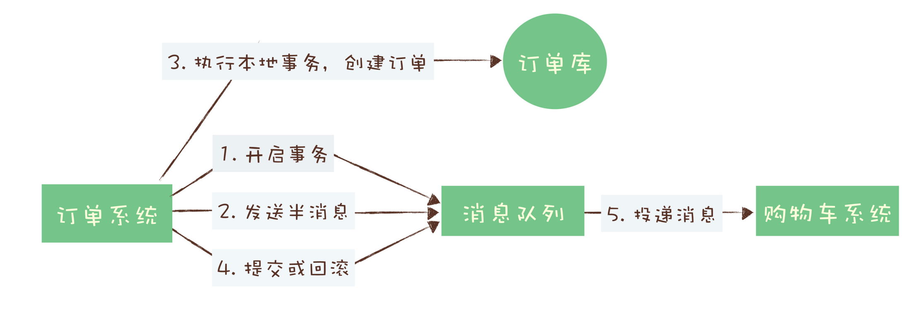

### 分布式事务 事务消息的流程

如果第3步执行成功，第4步提交或回滚失败，会怎么处理，rocketMQ会根据订单id或者其他的标识去生产端反查第3步是否确实成功，如果确实成功，则会继续将半消息回滚或提交

### 如何保证消失不丢

1： 生产阶段
同步的处理返回异常
异步的需要回调确认
2： broker阶段
单结点可配置写入磁盘后再ack返回
集群版，需要将 Broker 集群配置成：至少将消息发送到 2 个以上的节点，再给客户端回复发送确认响应。
3： 消费阶段
不要在收到消息后就立即发送消费确认，而是应该在执 行完所有消费业务逻辑之后，再发送消费确认。