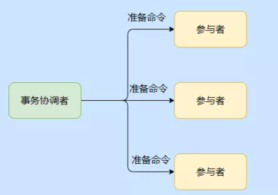
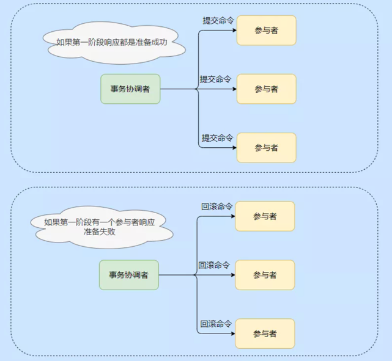
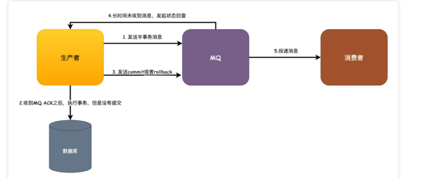

参考文章：
https://mp.weixin.qq.com/s/lvQYQfYcGIQv13Er3rfLFQ
https://mp.weixin.qq.com/s/TFDancDggPYdvMs1Zp75Fg
https://mp.weixin.qq.com/s/zp1kJ895zBb9vA7fgJ20eQ

> 随着微服务的盛行，单个服务独立部署，提高了服务的可用性及可靠性，耦合性。
> 但同时也引入了一系列的问题，原先可以本地事务执行来保证数据的acid。引入微服务后，服务之间通过RPC远程调用，相对单机事务来说，多了“网络通信”这一不确定因素，使得本来服务的调用只有“成功”和“失败”这两种返回结果，变为“成功”、“失败”和“未知”三种返回结果。
> 系统之间的通信可靠性从单一系统中的可靠变成了微服务架构之间的不可靠，分布式事务其实就是在不可靠的通信下实现事务的特性。

### 2pc
Two-phase commit protocol，两阶段提交协议。引入事务协调者角色tm(Transaction Manager)，来管理各个参与者RM(Resource Manager)，整个阶段分为两个部分，prepare阶段与commit/rollback阶段

2PC的过程比较简单，分为两个阶段：

**准备阶段**，协调者分别给每个参与者发送Prepare消息，每个参与者收到消息后，进行“预提交”操作（不是实际的提交操作），把操作的结果（成功或失败）返回给协调者。

**提交阶段**，协调者根据准备阶段收到的参与者的返回结果进行判断，如果所有的参与者都返回成功，那么分别给每个参与者发送Commit消息，否则发送Rollback消息。

- 准备阶段：

- 提交阶段

#### 存在的问题
同步阻塞（在执行事务的过程当中，所有数据库的资源都被锁定，如果这时候有其他人来访问这些资源，将会被阻塞，这是一个很大的性能问题）
单点故障（如果协调者出问题整个事务就执行不下去了）
数据不一致问题（在Commit阶段，可能存在只有部分参与者收到Commit消息（或处理成功）的情况）。

#### 场景
数据库的事务redo log与binlog的写入过程就是使用二阶段提交的方式 
### 3pc
Three-phase commit protocol，三阶段提交协议。流程分成了CanCommit、PreCommit、DoCommit三个步骤，比2pc多出CanCommit阶段

CanCommit阶段其实就是在执行事务之前来确认参与者是否正常，防止个别参与者不正常的情况下，其他参与者都执行了事务，锁定资源。

3PC 在参与者处也引入了超时机制，这样在协调者挂了的情况下，如果已经到了提交阶段了，参与者等半天没收到协调者的情况的话就会自动提交事务。

不过万一协调者发的是回滚命令呢？你看这就出错了，数据不一致了。

#### 相比2PC的改进
同步阻塞问题，加入了参与者的超时机制及canCommit阶段，所以原来2PC的如果某个参与者故障导致的同步阻塞的问题时间缩短了，这是一个优化，但是并没有完全避免。

单点故障问题，同样因为超时机制的引入，一定程度上也算是优化了。

但是数据不一致的问题，这个始终没有得到解决。

### tcc
TCC的模式叫做Try、Confirm、Cancel，实际上也就是2PC的一个变种而已。

实现这个模式，一个事务的接口需要拆分成3个，也就是Try预占、Confirm确认提交、最后Cancel回滚。

对于TCC来说，实际生产我基本上就没看见过有人用，考虑到原因，首先是程序员的本身素质参差不齐，多个团队协作你很难去约束别人按照你的规则来实现，另外一点就是太过于复杂。

TCC （Try-Confirm-Cancel）事务模型采用的是补偿机制，其核心思想是：针对每个操作，都要注册一个与其对应的确认和补偿操作。

相当于XA来说，TCC可以不依赖于资源管理器，即数据库，它是通过业务逻辑来控制确认和补偿操作的，所以它用了’Cancel’而非’Rollback’的字眼。它是一个应用层面的2PC
### saga
主要思想就是将长事务拆分成多个本地短事务。

如果全部执行成功，就正常完成了，反之，则会按照相反的顺序依次调用补偿。

SAGA模式有两种恢复策略：

向前恢复，这个模式偏向于一定要成功的场景，失败则会进行重试
向后恢复，也就是发生异常的子事务依次回滚补偿

### 消息事务
基于消息队列来实现最终一致性的方案，这个相比前面的我个人认为还稍微靠谱一点，那些都是理论啊，正常生产的实现很少看见应用。

基于消息队列的可能真正在应用的还稍微多一点。

一般来说有两种方式，基于本地消息表和依赖MQ本身的事务消息。

本地消息表的这个方案其实更复杂，实际上我也没看到过真正谁来用。这里我以RocketMQ的事务消息来举例，这个方式相比本地消息表则更完全依赖MQ本身的特性做了解耦，释放了业务开发的复杂工作量。

业务发起方，调用远程接口，向MQ发送一条半事务消息，MQ收到消息之后会返回给生产者一个ACK
生产者收到ACK之后，去执行事务，但是事务还没有提交。
生产者会根据事务的执行结果来决定发送commit提交或者rollback回滚到MQ
这一点是发生异常的情况，比如生产者宕机或者其他异常导致MQ长时间没有收到commit或者rollback的消息，这时候MQ会发起状态回查。
MQ如果收到的是commit的话就会去投递消息，消费者正常消费消息即可。如果是rollback的话，则会在设置的固定时间期限内去删除消息。
这个方案基于MQ来保证消息事务的最终一致性，还算是一个比较合理的解决方案，只要保证MQ的可靠性就可以正常实施应用，业务消费方根据本身的消息重试达到最终一致性。

###Seata
阿里的云服务，集成了以上的各种解决方案，可能会还不错吧

### 总结
总得看来，分布式事务的解决方案都很难做到有高一致性的同时，也有高性能，同时在实现上也有一定的难度。在业务允许的情况下，我们通常处理分布式事务的一般原则应是：业务规避 > 最终一致 > 强一致。

谈到2PC和3PC，2PC有同步阻塞、单点故障和数据不一致的问题，3PC在一定程度上解决了同步阻塞和单点故障的问题，但是还是没有完全解决数据不一致的问题。

之后说到TCC、SAGA、消息队列的最终一致性的方案，TCC由于实现过于麻烦和复杂，业务很少应用，SAGA了解即可，国内也很少有应用到的，消息队列提供了解耦的实现方式，对于中小公司来说可能是较为低成本的实现方式。

最后再说目前国内的实现框架，云端阿里云的GTS兼容Seata，非云端使用Seata，它提供了XA、TCC、AT、SAGA的解决方案，可以说是目前的主流选择。